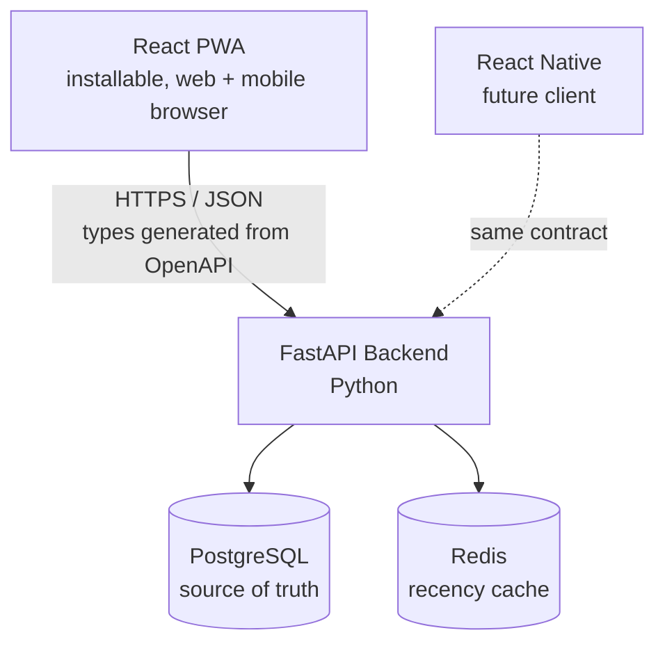

## What is Rekindle?
Rekindle is an platform / application for rediscovering or reminding you of the interests you have or once had but are forgetting.
## Why does it exist?
It's not like a spaced repetition app it is supposed to help you re encounter the ineterests you once had without any pressure in you'r free time when you feel like you have nothing to do.
## How does it work?
## 2. System Overview

  
## 3. Core Domain Concepts
| Concept | What it is |
|---|---|
| **Interest** | A topic the user cares about (e.g. "Databases", "Kafka", "Psychology") — also a **bandit arm** |
| **Snippet** | A specific saved nugget tied to an interest — a question, a fact, a note |
| **Exposure** | A log entry: this snippet was shown at this time, and here's how the user reacted |
| **alpha / beta** | Per-interest success/failure counters driving Thompson Sampling (replaces the old hand-tuned affinity formula) |
---
## Tech stack

**Frontend**
- React + TypeScript (Vite)
- Tailwind CSS + shadcn/ui — component primitives, fully restyled to match the design brief
- TanStack Query — server-state/data fetching
- React Router — client-side routing
- vite-plugin-pwa — installability, offline caching
- openapi-typescript — generates TS types from the backend's OpenAPI schema
- Vitest + React Testing Library — testing

**Backend**

- FastAPI + Uvicorn
- SQLAlchemy + Alembic — ORM + migrations
- Pydantic v2 — request/response schemas (also produces the OpenAPI spec)
- redis-py
- pytest — testing
Infra
- PostgreSQL 16
- Redis 7
- Docker + Docker Compose
## How to run it
### 1. Start infrastructure
docker compose up -d postgres redis

### 2. Start the backend

cd backend
source .venv/bin/activate
uvicorn app.main:app --reload
### → running at http://localhost:8000  (docs at /docs)

### 3. Start the frontend (new terminal)
cd frontend
npm install
npm run dev
### → running at http://localhost:5173
## Architecture
See [ARCHITECTURE.md](./ARCHITECTURE.md) for the full data model,
Thompson Sampling algorithm design, and API contract.