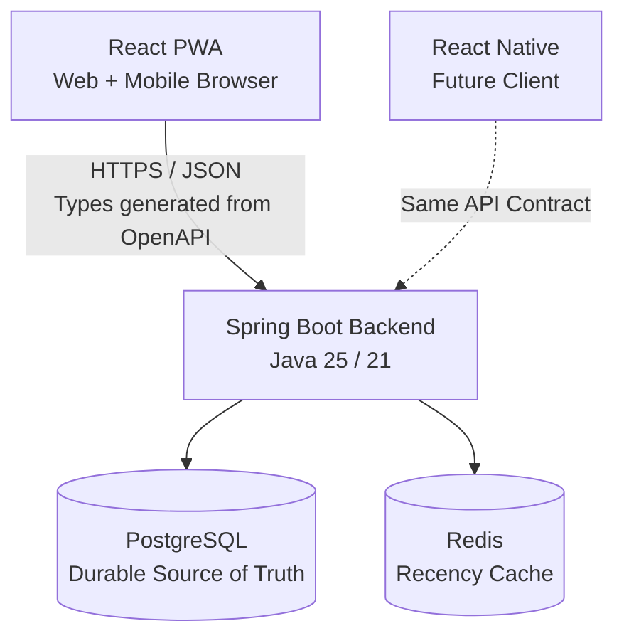
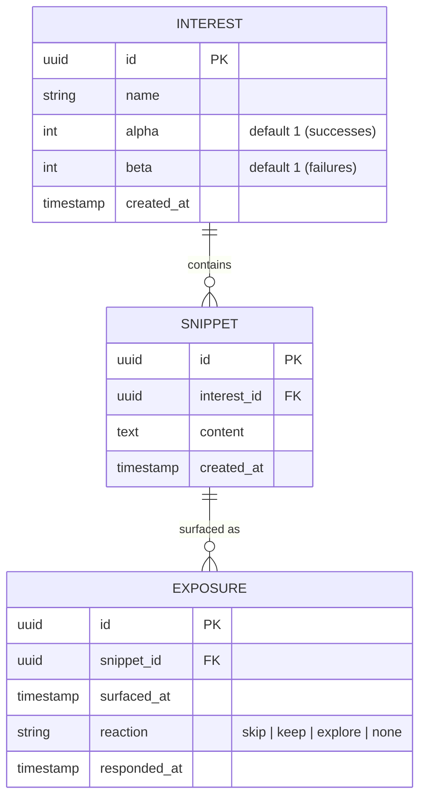
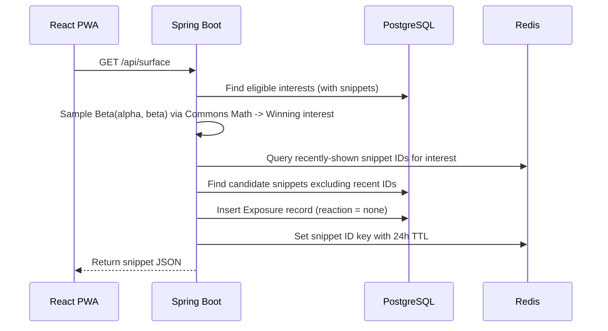
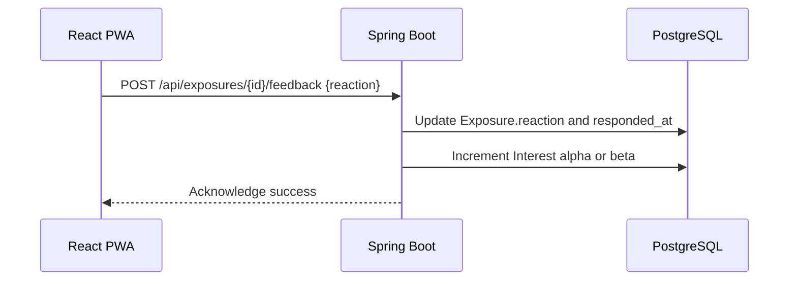

# Rekindle — MVP Architecture

## 1. What is Rekindle?

Rekindle is **not** a spaced-repetition tool or a study flashcard app. It does not ask *"what are you overdue to review?"* 

Instead, it asks: **"what would you enjoy rediscovering right now?"**

When you have an idle moment, Rekindle quietly surfaces one thought, note, or quote you saved in the past. There are no streaks, no due dates, no notifications, and no pressure.

---

## 2. System Overview

Rekindle is built as a **single backend** serving a React Progressive Web App (PWA) today, and native mobile clients in the future.



### Key Components:
- **Spring Boot (Java)**: Handles business logic, runs the Thompson Sampling bandit math via Apache Commons Math, and exposes the REST API with auto-generated OpenAPI documentation via `springdoc-openapi`.
- **PostgreSQL**: The permanent relational database storing interests, snippets, and exposure reaction history via Spring Data JPA / Hibernate.
- **Flyway**: Version-controlled database schema migrations.
- **Redis**: In-memory recency cache managed via Spring Data Redis (`StringRedisTemplate`). It answers one question: *"Was this snippet shown in the last 24 hours?"*
- **React PWA**: A calm, mobile-first interface installable directly to the home screen with type-safe clients generated via `openapi-typescript`.

---

## 3. Core Concepts

| Concept | Plain English Meaning |
|---|---|
| **Interest** | A topic you care about (e.g., "Databases", "Jazz", "Psychology"). In math terms, this is an "arm" of a multi-armed bandit. |
| **Snippet** | A short saved note, question, or quote belonging to an interest. |
| **Exposure** | A record of a snippet being shown to you, along with your reaction. |
| **alpha (α) & beta (β)** | Two integer counters per interest. α counts positive reactions (`keep`, `explore`), and β counts negative reactions (`skip`). |

---

## 4. Data Model



---

## 5. Suggestion Engine — Thompson Sampling (Apache Commons Math)

Rekindle uses **Thompson Sampling** (Beta-Bernoulli bandit) split into two decoupled decisions:

### Step 1 — Pick the Topic (The Bandit)
Draw one random sample from `Beta(alpha, beta)` per interest **that has at least one snippet**. Pick the interest with the highest sample.

```java
import org.apache.commons.math3.distribution.BetaDistribution;

public UUID pickInterest(List<Interest> eligibleInterests) {
    Map<UUID, Double> samples = new HashMap<>();
    for (Interest i : eligibleInterests) {
        samples.put(i.getId(), new BetaDistribution(i.getAlpha(), i.getBeta()).sample());
    }
    return Collections.max(samples.entrySet(), Map.Entry.comparingByValue()).getKey();
}
```

- New interests start at `Beta(1, 1)` (flat prior), naturally encouraging early exploration.
- Confident, well-liked interests usually win; uncertain ones still surface occasionally.

### Step 2 — Pick the Snippet (Recency Filter)
1. Query snippets under the winning interest.
2. Filter out any snippet IDs stored in Redis (set with a 24-hour TTL).
3. Pick randomly from the remaining candidates.
4. Record the chosen snippet ID in Redis with a 24-hour expiration.

### Step 3 — Record Feedback
- **`keep`** or **`explore`** → `alpha += 1`
- **`skip`** → `beta += 1`

---

## 6. API Contract

| Method | Path | Purpose |
|---|---|---|
| `GET` | `/health` | Sanity check returning `{"status": "ok"}` |
| `POST` | `/api/interests` | Create an interest topic |
| `GET` | `/api/interests` | List interests (+ α/β, snippet count) |
| `POST` | `/api/interests/{id}/snippets` | Add a snippet under an interest |
| `GET` | `/api/surface` | Run Thompson Sampling, return one snippet |
| `POST` | `/api/exposures/{id}/feedback` | Record `skip`/`keep`/`explore`, update α/β |
| `GET` | `/api/snippets?interestId=` | List snippets for "explore more" |

`springdoc-openapi` automatically generates the OpenAPI v3 specification at `/v3/api-docs`, allowing the frontend to generate compile-time safe TypeScript types via `openapi-typescript`.

---

## 7. Request Flows

### Surfacing a Snippet


### Responding to a Snippet


---

## 8. Suggested Backend Structure

```text
backend/
├── build.gradle
├── settings.gradle
├── gradlew / gradlew.bat
└── src/
    ├── main/
    │   ├── java/com/rekindle/
    │   │   ├── RekindleApplication.java
    │   │   ├── controller/      # @RestController classes
    │   │   ├── service/         # SuggestionService, FeedbackService
    │   │   ├── repository/      # Spring Data JPA interfaces
    │   │   ├── entity/          # JPA @Entity classes (Interest, Snippet, Exposure)
    │   │   ├── dto/             # Java Records for requests/responses
    │   │   └── config/          # CorsConfig, RedisConfig, OpenApiConfig
    │   └── resources/
    │       ├── application.yml
    │       └── db/migration/    # Flyway SQL migrations (V1__init.sql)
    └── test/
        └── java/com/rekindle/   # JUnit 5 & Mockito tests
```
