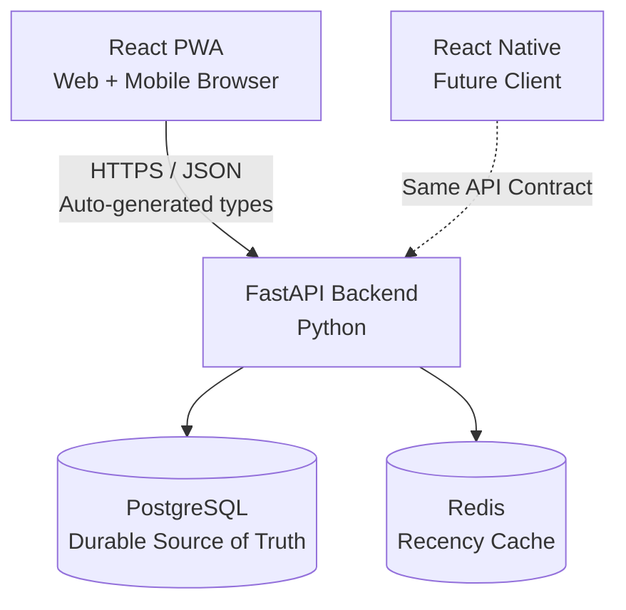
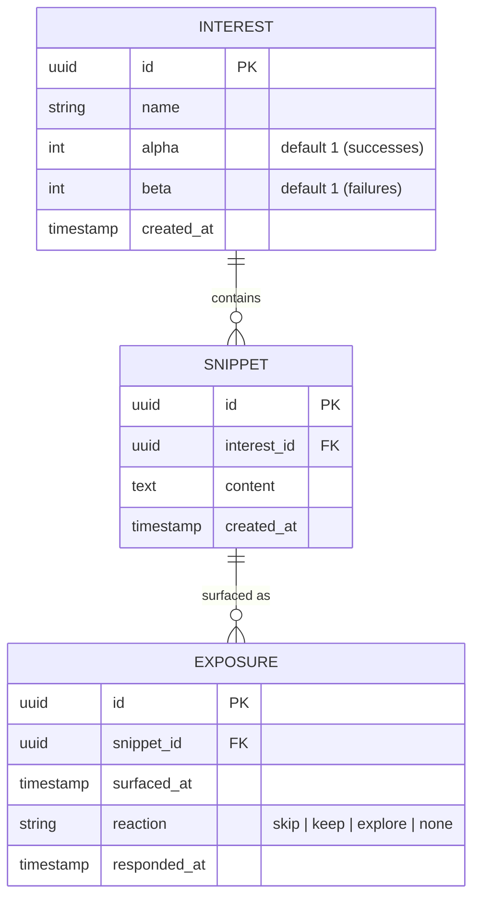
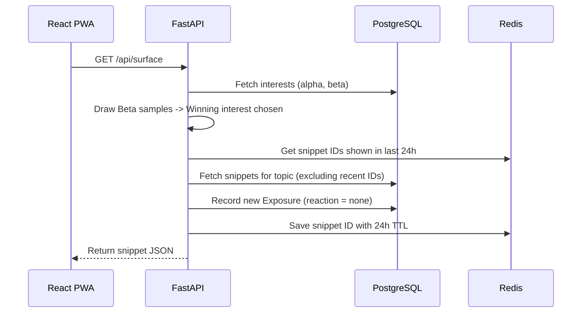
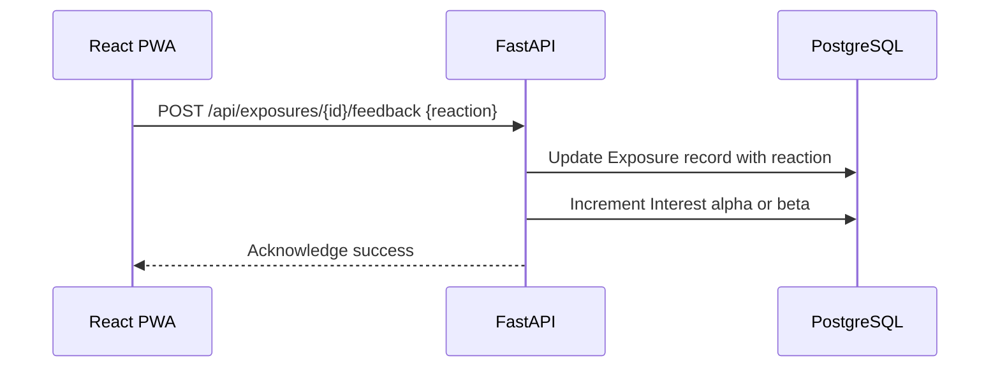

# Rekindle — MVP Architecture

## 1. What is Rekindle?

Rekindle is **not** a spaced-repetition tool or a study flashcard app. It does not ask *"what are you overdue to review?"* 

Instead, it asks: **"what would you enjoy rediscovering right now?"**

When you have an idle moment, Rekindle quietly surfaces one thought, note, or quote you saved in the past. There are no streaks, no due dates, no notifications, and no pressure.

---

## 2. System Overview

Rekindle is built as a **single backend** that can serve any client: a React Progressive Web App (PWA) today, and native mobile apps in the future.

### Key Components:
- **FastAPI (Python)**: Handles all business logic, runs the recommendation math, and serves the REST API.
- **PostgreSQL**: The permanent database where your interests, snippets, and reaction history are stored.
- **Redis**: An in-memory temporary cache with automatic expiration (TTL). It only answers one question: *"Was this snippet shown in the last 24 hours?"*
- **React PWA**: A calm, mobile-friendly interface installable directly to your home screen.

---

## 3. Core Concepts

| Concept | Plain English Meaning |
|---|---|
| **Interest** | A topic you care about (e.g., "Databases", "Jazz", "Psychology"). In math terms, this is an "arm" of a multi-armed bandit. |
| **Snippet** | A short saved note, question, or quote belonging to an interest. |
| **Exposure** | A record of a snippet being shown to you, along with your reaction. |
| **alpha (α) & beta (β)** | Two numbers per interest. α counts positive reactions (`keep`, `explore`), and β counts negative reactions (`skip`). |

---

## 4. Data Model

---

## 5. How Rekindle Chooses What to Show (Thompson Sampling)

Instead of a complex, hand-tuned formula, Rekindle uses **Thompson Sampling** (a classic Bayesian algorithm) split into two simple steps:

### Step 1 — Pick the Topic (The Bandit)
1. For every interest that has at least one snippet, draw a random number from a `Beta(alpha, beta)` probability curve.
2. The interest that draws the highest random number wins.
   - **Why this works**: New topics start at `Beta(1, 1)` (wide uncertainty), giving them a fair chance to be explored early. Topics you frequently keep will have higher α and win more often, but less-explored topics still pop up occasionally.

### Step 2 — Pick the Snippet (Recency Filter)
1. From the winning interest, look up all snippets.
2. Filter out any snippets stored in the Redis 24-hour recency cache.
3. Pick randomly from the remaining snippets.
4. Save the chosen snippet to Redis with a 24-hour expiration so it cools down.

### Step 3 — Record Feedback
When you react, Rekindle updates the topic's counters:
- **`keep`** or **`explore`** → increase α by 1 (topic liked)
- **`skip`** → increase β by 1 (topic passed on)

---

## 6. API Endpoints

| Method | Path | What It Does |
|---|---|---|
| `GET` | `/health` | Sanity check returning `{"status": "ok"}` |
| `POST` | `/api/interests` | Create a new interest topic |
| `GET` | `/api/interests` | List all interests and their α/β scores |
| `POST` | `/api/interests/{id}/snippets` | Add a snippet under an interest |
| `GET` | `/api/surface` | Run Thompson Sampling and return one snippet to read |
| `POST` | `/api/exposures/{id}/feedback` | Send reaction (`skip`, `keep`, `explore`) |
| `GET` | `/api/snippets?interestId=` | Fetch other snippets under the same topic for "explore more" |

---

## 7. Request Flows

### Surfacing a Snippet

### Responding to a Snippet

---

## 8. MVP Scope & Boundaries

### What is Included:
- Single-user, zero complicated authentication.
- Manual entry for interests and snippets.
- Beta-Bernoulli Thompson Sampling algorithm.
- 24-hour Redis cooldown for surfaced snippets.
- Calm, mobile-first PWA interface.

### What is Deferred:
- Background task queues (Kafka/Celery).
- Push notifications (violates the calm, no-pressure philosophy).
- Complex 1–5 star rating scales.
- Multi-user authentication.
